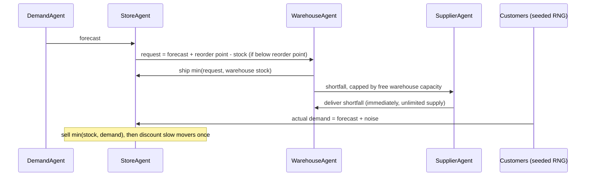

# SmartStock AI – Multi-Agent Retail Inventory Optimization

[](https://github.com/1AyaNabil1/Optimizing-Retail-Inventory-with-Multi-Agents/actions/workflows/test.yml)


SmartStock AI is a **hackathon prototype**: a small, rule-based multi-agent simulation of a retail supply chain. A demand agent, a store agent, a warehouse agent and a supplier agent each apply a simple decision rule. Units move between them step by step, so you can watch how the rules lead to stockouts, replenishment and discounts on the inventory data provided by the hackathon organizers.

It was built for the **"Hack the Future: A Gen AI Sprint Powered by Data"** hackathon. The goal was to tackle stockouts, overstocking and manual replenishment by having agents automate demand prediction, restocking and price adjustment. The decision rules are hand-written heuristics, not trained models. The simulation is reproducible: the same seed always gives the same result. It checks its own bookkeeping as it runs, and tests cover the agents' rules.

---

## How the agents interact

Each time step, for every simulated product, a small orchestrator (`run_smartstock_ai` in `main.py`) calls the agents in a fixed order. Each agent returns its decision as a plain value, and the orchestrator passes that value to the next agent:



| Agent | Rule (all quantities are whole units) |
|---|---|
| `DemandAgent` | `forecast = Sales Quantity × trend multiplier` (1.1 for Increasing, 0.9 for Decreasing, 1.0 otherwise), using the product's first row in `demand_forecasting.csv`. |
| `StoreAgent` | Requests stock when `stock - forecast < Reorder Point`, asking for `forecast + Reorder Point - stock`. With a reorder point of 0 this reduces to the original "stock below demand" rule. Sells `min(stock, demand)`, so its stock never goes negative. Gives a one-off 10% discount when a product needed no replenishment and its `Sales Volume` is under 100. |
| `WarehouseAgent` | Starts with `Warehouse Capacity` as its stock, because the dataset has no warehouse on-hand column. It ships what it can and orders any shortfall from the supplier, never holding more than its capacity. |
| `SupplierAgent` | Delivers whatever the warehouse orders, straight away. |
| `CustomerAgent` | Reports the product's customer segment and demand trend. It is informational and does not affect other agents' decisions. |

Actual customer demand is the forecast plus normal noise (standard deviation `demand_noise × forecast`), drawn from a seeded `numpy` random generator. After every product step the orchestrator checks two invariants and raises `InvariantViolation` if either fails:

- No stock level is negative.
- Store stock + warehouse stock = starting stock + supplier deliveries - units sold.

---

## Quick start

Requires Python 3.11 or later.

```bash
git clone https://github.com/1AyaNabil1/Optimizing-Retail-Inventory-with-Multi-Agents.git
cd Optimizing-Retail-Inventory-with-Multi-Agents
python -m venv .venv && source .venv/bin/activate   # Windows: .venv\Scripts\activate
pip install -r requirements.txt

python -m Smart_Stock_Ai.main                # 5 steps, 3 products, seed 42
python -m Smart_Stock_Ai.database            # standalone SQLite demo
```

Run the commands from the repository root. The data folder is found relative to the package, so the working directory does not matter for the data.

### Example run (real output)

The agents log what they do to stderr. Here is one step (`python -m Smart_Stock_Ai.main --steps 1`):

```text
Starting SmartStock AI Simulation...
DemandAgent: Product 4277 - Predicted demand = 363 units
StoreAgent: Product 4277 at Store 44 - Stock = 10, Demand = 363, Reorder point = 19
StoreAgent: Requesting 372 units from Warehouse
WarehouseAgent: Product 4277 - Sent 372 units to Store
SupplierAgent: No restock needed
CustomerAgent: Product 4277 - Segment = Regular, Trend = Increasing
StoreAgent: Product 4277 - Stockout, sold 382 of 385 units (3 unmet)
DemandAgent: Product 5540 - Predicted demand = 334 units
StoreAgent: Product 5540 at Store 81 - Stock = 966, Demand = 334, Reorder point = 12
StoreAgent: Stock sufficient
...
--- Time Step 1 Complete ---
```

The summary goes to stdout. Here it is for the default run (`python -m Smart_Stock_Ai.main --quiet`):

```text
Summary after 5 steps (seed=42):
 product  store_start  wh_start  demand  sold  unmet  fill_rate  stockout_steps  shipped  delivered  store_end  wh_end
    4277           10      1504    1857  1518    339      0.817               3     1508        305          0     301
    5540          966      4959    1584  1474    110      0.931               2      508          0          0    4451
    5406          296      3169    1982  1982      0      1.000               0     1778          0         92    1391
Total: demand 5423, sold 4974, fill rate 91.7%
```

These numbers describe the toy model, not a real store. Two things show up when you read the step history (`--history-csv`):

- **Product 5540** runs out on the shelf while the warehouse still holds 4,451 units. The store only orders up to `forecast + reorder point`, and its reorder point (12) is tiny next to the default demand noise (standard deviation 20% of the forecast). The rules keep no safety stock.
- **Product 4277** has a stockout even with perfect forecasts (`--demand-noise 0`). The warehouse runs dry in step 5, and the supplier's delivery only reaches the store in the next step.

---

## Configuration

| Option | Default | Meaning |
|---|---|---|
| `--steps N` | 5 | Number of time steps |
| `--products N` | 3 | Simulate the first N products in `demand_forecasting.csv` that also have inventory data |
| `--product-ids ID [ID ...]` | – | Simulate these products instead (each must exist in both files) |
| `--seed N` | 42 | Seed for the demand noise; the same seed and data give identical runs |
| `--demand-noise X` | 0.2 | Demand standard deviation as a fraction of the forecast; `0` makes demand equal the forecast |
| `--data-dir PATH` | `data/` | Folder with the three CSVs; can also be set with the `SMARTSTOCK_DATA_DIR` env var |
| `--history-csv PATH` | – | Write the per-step history (one row per step and product) to a CSV file |
| `--delay SECONDS` | 0 | Pause between steps, for live demos |
| `--log-level LEVEL` / `-q` | INFO | Agent log verbosity; `-q` prints only the summary |

You can also run the simulation from Python:

```python
from Smart_Stock_Ai.main import SimulationConfig, run_smartstock_ai

result = run_smartstock_ai(SimulationConfig(steps=10, num_products=5, seed=7))
result.summary  # one row per product (pandas DataFrame)
result.history  # one row per step and product
result.pricing  # pricing table after discounts (the input data is not modified)
```

---

## Dataset

The `data/` directory holds the CSVs provided for the hackathon. Each file has 10,000 rows.

| File | Columns used by the agents |
|------|-------------|
| `demand_forecasting.csv` | `Product ID`, `Sales Quantity`, `Demand Trend`, `Customer Segments` |
| `inventory_monitoring.csv` | `Product ID`, `Store ID`, `Stock Levels`, `Reorder Point`, `Warehouse Capacity` |
| `pricing_optimization.csv` | `Product ID`, `Price`, `Sales Volume` |

Product IDs do not line up across the files: only 4,081 of the 6,065 distinct products in the demand file appear in the inventory file. The simulation therefore picks products that exist in both. A product with no pricing row simply skips the pricing step. The loader checks for the columns above and fails with a clear message if one is missing.

---

## Project structure

```text
Smart_Stock_Ai/
├── main.py             # orchestrator, invariant checks, summary, CLI
├── data.py             # data folder resolution, CSV loading and validation
├── demand_agent.py
├── store_agent.py
├── warehouse_agent.py
├── supplier_agent.py
├── customer_agent.py
└── database.py         # in-memory SQLite inventory demo (not used by the simulation)
data/                   # hackathon datasets
tests/                  # pytest suite (offline, a few seconds)
```

---

## Tests and CI

```bash
pip install -r requirements-dev.txt
ruff check . && ruff format --check .
pytest
```

The 54 tests cover:

- **Each agent's rule**, including the reorder-point boundary, partial warehouse fills, the capacity cap and the one-off discount.
- **A hand-computed three-step run** on a tiny dataset.
- **Conservation of units and non-negative stock** at every step on the bundled data, for several seeds.
- **Seed reproducibility.**
- **The CLI and the data loading.**

There are also regression tests for bugs fixed in the original prototype:

- A stale supplier order repeated every step.
- Discounts compounded and overwrote other stores' prices.
- The SQLite demo could store numpy integers as BLOBs, so every lookup returned 0.

GitHub Actions ([`.github/workflows/test.yml`](.github/workflows/test.yml)) runs ruff, pytest and a short simulation on Python 3.11, 3.12 and 3.13 for every push and pull request.

---

## Limitations

This is a prototype for exploring agent rules, not an inventory system:

- **Heuristic rules, no learning.** The forecast is one CSV record times a trend multiplier. It stays the same every step and does not learn from simulated sales. Nothing here uses machine learning or an LLM.
- **Simplified network.** Each product uses its first inventory row, so one store, one warehouse and one supplier. Multiple stores competing for warehouse stock are not modelled.
- **Assumed quantities.** Warehouse stock starts at `Warehouse Capacity` because the data has no on-hand figure. Actual demand is forecast plus Gaussian noise, an assumption rather than something estimated from the data. The data does not say what period `Sales Quantity` covers, so a "step" has no fixed real-world length.
- **Unused data.** Supplier lead times, order fulfilment times, expiry dates and most pricing columns are ignored, and the supplier is unlimited and instant.
- **Prices don't feed back.** Discounts change the pricing table but not demand.
- **No live coordination.** The agents are plain Python objects called in a fixed order. There is no message bus, concurrency or negotiation.
- **SQLite demo not wired in.** `database.py` is a standalone in-memory demo.

The hackathon pitch included projected business impact figures. This code does not measure them, so they are not repeated here.

---

## Ideas for future work

- Model supplier lead times and order backlogs
- Learn forecasts from history instead of the single-record rule
- Simulate several stores sharing a warehouse
- Integrate an agent framework such as SPADE or Mesa
- Feed in real data from APIs and POS systems
- Build a web dashboard for live tracking (none exists in this repository yet)

---

## Hackathon Context

* **Team**: AyaNeXus (Solo Participant: Aya Nabil)

* **Project Name**: SmartStock AI

* **Submission File**: AyaNeXus_SmartStockAI.pptx

* **Date**: April 6, 2025

* **Event**: Hack the Future: A Gen AI Sprint Powered by Data

---

## Acknowledgments

Hackathon organizers for providing initial datasets and problem statements.

Python open-source community for tools that made rapid prototyping possible.

For feedback or questions, contact ayanabil297@gmail.com

Happy Hacking!

## License

MIT, see [LICENSE](LICENSE).
